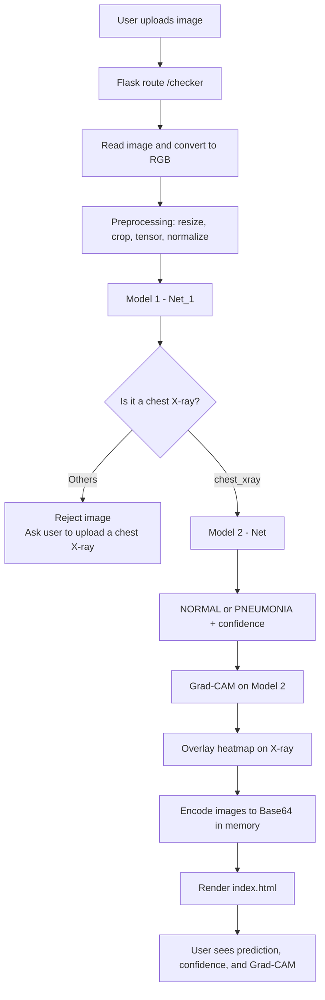

# 🫁 Lung Disease Detection using Deep Learning

A two-stage CNN web application that first checks if an uploaded image is a chest X-ray, then classifies it as NORMAL or PNEUMONIA, and finally explains the prediction using Grad-CAM.

**The idea of this project is simple: validate first, classify second, explain the prediction.**

| Stage | Question it answers |
|---|---|
| Model 1 | Is this image a chest X-ray? |
| Model 2 | If yes, is it NORMAL or PNEUMONIA? |
| Grad-CAM | Which regions influenced that prediction? |

> **Medical Disclaimer**
> This is an educational and research project. It is not a medical device, it is not clinically validated, and it must not be used for real patient diagnosis or treatment decisions. It is not a replacement for a radiologist or a doctor.

---

## Table of Contents

- [Overview](#overview)
- [Key Features](#key-features)
- [Why Two Models?](#why-two-models)
- [System Architecture](#system-architecture)
- [Model 1 — Chest X-ray Validator](#model-1--chest-x-ray-validator)
- [Model 2 — Pneumonia Classifier](#model-2--pneumonia-classifier)
- [CNN Architecture](#cnn-architecture)
- [Image Preprocessing](#image-preprocessing)
- [Training Setup](#training-setup)
- [Grad-CAM Explainability](#grad-cam-explainability)
- [Application Workflow](#application-workflow)
- [Web Interface](#web-interface)
- [Project Structure](#project-structure)
- [Dataset Structure](#dataset-structure)
- [Installation](#installation)
- [Running the Application](#running-the-application)
- [Example Prediction Flow](#example-prediction-flow)
- [Results](#results)
- [Confidence Score](#confidence-score)
- [Limitations](#limitations)
- [Future Scope](#future-scope)
- [Technologies Used](#technologies-used)
- [Skills and Concepts Demonstrated](#skills-and-concepts-demonstrated)
- [Disclaimer](#disclaimer)
- [Author](#author)

---

## Overview

This project is a deep learning web application for chest X-ray image classification. The user uploads an image through a Flask web page. The application then does three things:

1. It checks whether the uploaded image is really a chest X-ray.
2. If it is, it classifies the X-ray as NORMAL or PNEUMONIA and gives a confidence score.
3. It generates a Grad-CAM image that shows which parts of the X-ray influenced the prediction.

If the uploaded image is not a chest X-ray, the image is rejected and the user is asked to upload a chest X-ray. In that case the pneumonia model never runs.

Both CNN models were written from scratch in PyTorch. The application runs locally.

---

## Key Features

- Two-stage CNN pipeline: input validation, then disease classification
- Rejects images that are not chest X-rays
- NORMAL vs PNEUMONIA classification with a confidence score
- Grad-CAM visual explanation for the pneumonia model
- Grad-CAM image is generated in memory and sent to the browser as Base64, not saved to disk
- Simple Flask web interface for upload and results
- Small custom CNN models (approximately 11,486 parameters each), no pretrained backbones

---

## Why Two Models?

A single pneumonia classifier only knows two classes: NORMAL and PNEUMONIA. If someone uploads a photo of a car, that model will still output one of those two labels, because it has no other option. That result would be meaningless.

Model 1 solves this by acting as a gate.

**1. Input validation**
Model 1 checks whether the uploaded image is actually a chest X-ray before anything else happens.

**2. Task specialization**
Model 1 learns image-type classification. Model 2 only focuses on NORMAL vs PNEUMONIA. Each model has one job.

**3. Preventing irrelevant predictions**
Unrelated images are stopped early instead of being forced into a disease label.

**4. Easier maintenance**
Each model can be retrained, replaced, or improved on its own without touching the other.

**5. Future scalability**
The same gating idea can later route other medical image types to other models.

> Note: using two models does not automatically improve accuracy. The benefit is validation, specialization, and modularity.

---

## System Architecture



---

## Model 1 — Chest X-ray Validator

**Purpose:** decide whether an uploaded image is a chest X-ray or some other kind of image.

| Item | Value |
|---|---|
| Python class | `Net_1` |
| File | `src/xray_detector_model.py` |
| Weights | `models/xray_detector.pth` |
| Classes | `Others`, `chest_xray` |
| Test accuracy | 99.96% (2,490 of 2,491 test images) |

### Dataset

| Split | chest_xray | Others | Total |
|---|---|---|---|
| Train | 4,686 | 5,281 | 9,965 |
| Test | 1,172 | 1,321 | 2,491 |
| **Total** | **5,858** | **6,602** | **12,456** |

### Role in the pipeline

```
Uploaded image
      ↓
   Model 1
      ↓
Is it a chest X-ray?
      ├── Others     → reject, ask for a chest X-ray
      └── chest_xray → send to Model 2
```

---

## Model 2 — Pneumonia Classifier

**Purpose:** classify a confirmed chest X-ray as NORMAL or PNEUMONIA.

| Item | Value |
|---|---|
| Python class | `Net` |
| File | `src/model.py` |
| Weights | `models/trained_model.pth` |
| Classes | `NORMAL`, `PNEUMONIA` |

### Dataset

| Split | NORMAL | PNEUMONIA | Total |
|---|---|---|---|
| Train | 1,266 | 3,418 | 4,684 |
| Test | 317 | 855 | 1,172 |
| **Total** | **1,583** | **4,273** | **5,856** |


## CNN Architecture

Both models use custom CNN architectures written from scratch in PyTorch. They do **not** use ResNet, VGG, EfficientNet, any pretrained backbone, or transfer learning.

The networks are intentionally small, with roughly **11,486 parameters** each. They are fully convolutional and use Global Average Pooling instead of large fully connected layers.

### Layer flow

```
Input: 3 × 224 × 224

Conv2d 3 → 8      → ReLU → BatchNorm → MaxPool
Conv2d 8 → 20     → ReLU → BatchNorm → MaxPool
Conv2d 20 → 10 (1×1) → ReLU → BatchNorm → MaxPool
Conv2d 10 → 20    → ReLU → BatchNorm
Conv2d 20 → 32 (1×1) → ReLU → BatchNorm
Conv2d 32 → 10    → ReLU → BatchNorm
Conv2d 10 → 10 (1×1) → ReLU → BatchNorm
Conv2d 10 → 14    → ReLU → BatchNorm
Conv2d 14 → 16    → ReLU → BatchNorm

Global Average Pooling
Conv2d 16 → 2
reshape
log_softmax
```

### What each part does

| Component | What it does |
|---|---|
| `Conv2d` | Learns visual features from the image |
| `1×1 Conv2d` | Changes the number of channels efficiently |
| `ReLU` | Adds non-linearity |
| `BatchNorm` | Helps stabilise and speed up training |
| `MaxPool` | Reduces image size while keeping important features |
| Global Average Pooling | Summarises feature maps without a large fully connected layer |
| Final `Conv2d` | Produces scores for the two classes |
| `log_softmax` | Produces log-probabilities |

---

## Image Preprocessing

At inference time, every uploaded image goes through the same steps:

```
Uploaded image
→ Convert to RGB
→ Resize(224)
→ CenterCrop(224 × 224)
→ ToTensor()
→ Normalize()
→ Add batch dimension
→ Model
```

Normalisation values:

| Channel stat | Value |
|---|---|
| Mean | `[0.485, 0.456, 0.406]` |
| Std | `[0.229, 0.224, 0.225]` |

During training, extra augmentation was used:

| Model | Augmentation |
|---|---|
| Model 1 | RandomHorizontalFlip, RandomRotation(10) |
| Model 2 | ColorJitter, RandomHorizontalFlip, RandomRotation(10) |

Test and inference data do not use random augmentation.

---

## Training Setup

| Setting | Value |
|---|---|
| Framework | PyTorch |
| Dataset loading | `torchvision.datasets.ImageFolder` |
| Data loading | PyTorch `DataLoader` |
| Loss function | Negative Log Likelihood Loss (`F.nll_loss`) |
| Optimizer | SGD |
| Learning rate | 0.01 |
| Momentum | 0.8 |
| Scheduler | StepLR |
| Step size | 6 epochs |
| Gamma | 0.5 |
| Batch size | 32 |
| Model 1 epochs | 25 |
| Model 2 epochs | 20 |
| Hardware | Apple Silicon Mac |
| Device | PyTorch MPS where available, CPU fallback |

Training and evaluation notebooks:

- `notebook/model_1.ipynb` — Model 1 training, evaluation, and experiments
- `notebook/experiment.ipynb` — Model 2 training, evaluation, and experiments

---

## Grad-CAM Explainability

### What it is

Grad-CAM is a technique that shows which regions of an image influenced a model's prediction. It produces a heatmap that is placed on top of the original image.

### Why it is used here

A prediction on its own does not tell you anything about how the model reached it. Grad-CAM makes the model's behaviour easier to inspect and easier to trust or question.

### Where it is applied

Grad-CAM is applied **only to Model 2**, the pneumonia classifier. Model 1 is used for input validation only and has no Grad-CAM output.

**Target layer:** `model.convolution_block9`

This layer produces the feature maps used to build the heatmap.

### How it works

The `generate_gradcam()` function:

1. Registers a forward hook and a backward hook on the target layer
2. Runs the model on the image
3. Finds the predicted class and its confidence
4. Takes the score for the predicted class and runs backpropagation
5. Collects the stored activations and gradients
6. Calculates gradient-based weights and builds the class activation map
7. Applies ReLU, normalises the map, and resizes it to 224 × 224
8. Applies an OpenCV colour map and overlays it on the original X-ray
9. Returns the predicted class, the confidence, and the overlay image

### Grad-CAM is never saved to disk

This is an intentional design choice. The generated image is not written with `cv2.imwrite()` and is not stored in `static/`, `output/`, `images/`, or `uploads/`. It exists only in memory for the duration of the request.

```
Grad-CAM NumPy image
→ PNG encoded in memory
→ Base64 string
→ Flask
→ HTML
→ Browser (Base64 data URL)
```

Because of this, the application does not create or accumulate image files on the server.

### How to read the output

The highlighted regions show what the model paid attention to. They do **not** prove where pneumonia is located, and they do not prove that pneumonia exists. Grad-CAM explains the model, not the patient.

---

## Application Workflow

```
User
 ↓
Upload image (JPG / PNG)
 ↓
Flask route /checker
 ↓
Read image → RGB conversion → preprocessing
 ↓
Model 1
 ↓
Is it a chest X-ray?
 ├── NO  → Others → reject → "Please upload a chest X-ray."
 └── YES
      ↓
    Model 2
      ↓
    NORMAL / PNEUMONIA
      ↓
    Confidence score
      ↓
    Grad-CAM
      ↓
    Original X-ray + Grad-CAM overlay (Base64)
      ↓
    Flask renders index.html
      ↓
    User sees the result
```

---

## Web Interface

The Flask application (`app.py`) provides a simple local web interface.

| Item | Value |
|---|---|
| Home route | `/` — shows the upload page |
| Prediction route | `/checker` — receives the image and returns the result |
| Upload field name | `inp_file` |
| Maximum upload size | 16 MB |
| Example formats | JPG, PNG |
| Typical URL | `http://127.0.0.1:5000` |

There is currently no public cloud deployment. The application runs locally.

### What the user sees

For a valid chest X-ray, the page shows the prediction and the confidence score, followed by the model explanation section with both images side by side:

```
+----------------------+----------------------+
| Original X-ray       | Grad-CAM             |
|                      |                      |
|       X-ray          |   X-ray + heatmap    |
|                      |                      |
+----------------------+----------------------+
```

The explanation text on the page is kept simple: *"Grad-CAM highlights the regions that contributed to the model's prediction."*

For a rejected image, the user is asked to upload a chest X-ray instead. No prediction, confidence, or Grad-CAM is shown.

---

## Project Structure

```
Lung_Disease-_Detection/
│
├── models/
│   ├── trained_model.pth        # Model 2 weights (pneumonia classifier)
│   └── xray_detector.pth        # Model 1 weights (X-ray validator)
│
├── notebook/
│   ├── experiment.ipynb         # Model 2 training and evaluation
│   └── model_1.ipynb            # Model 1 training and evaluation
│
├── src/
│   ├── __init__.py
│   ├── model.py                 # Net — Model 2 CNN architecture
│   ├── xray_detector_model.py   # Net_1 — Model 1 CNN architecture
│   └── gradcam.py               # Grad-CAM function for Model 2
│
├── templates/
│   └── index.html               # Upload form and result display
│
├── app.py                       # Flask app: loads models, runs inference, Base64 output
├── requirements.txt
├── .gitignore
└── README.md
```

> **Note on current state:** Grad-CAM has been implemented and tested, and `src/gradcam.py` is part of the current project structure. The published GitHub repository may not yet reflect the latest Grad-CAM integration.

### File-by-file

| Path | Purpose |
|---|---|
| `models/trained_model.pth` | Trained weights for Model 2 |
| `models/xray_detector.pth` | Trained weights for Model 1 |
| `notebook/model_1.ipynb` | Training, evaluation, and experiments for Model 1 |
| `notebook/experiment.ipynb` | Training, evaluation, and experiments for Model 2 |
| `src/model.py` | The `Net` class, Model 2 architecture |
| `src/xray_detector_model.py` | The `Net_1` class, Model 1 architecture |
| `src/gradcam.py` | Grad-CAM explainability function for Model 2 |
| `templates/index.html` | Frontend: upload form, prediction, confidence, Grad-CAM display |
| `app.py` | Flask application and full inference pipeline |
| `requirements.txt` | Python dependencies |
| `.gitignore` | Keeps datasets and local files out of the repository |

### Model loading

The trained models are saved as PyTorch `state_dict` files. A `.pth` file contains only the learned weights, so the Python model class must be defined and created first to rebuild the architecture before the weights can be loaded.

```python
model = Net()
model.load_state_dict(
    torch.load("models/trained_model.pth", map_location="cpu")
)
model.eval()
```

> The repository currently has development-specific absolute model paths in `app.py`. These should be changed to project-relative paths such as `models/trained_model.pth` and `models/xray_detector.pth` so the project runs on any machine.

---

## Dataset Structure

The datasets are **not included in this repository** because of their size. They are excluded using `.gitignore`. Both datasets use `ImageFolder`, where the folder name is the class label.

**Model 2 dataset:**

```
Data/
├── train/
│   ├── NORMAL/
│   └── PNEUMONIA/
└── test/
    ├── NORMAL/
    └── PNEUMONIA/
```

**Model 1 dataset:**

```
model_1_dataset/
├── train/
│   ├── chest_xray/
│   └── Others/
└── test/
    ├── chest_xray/
    └── Others/
```

---

## Installation

**1. Clone the repository**

```bash
git clone https://github.com/vineetbathla8-boop/Lung_Disease-_Detection.git
```

**2. Enter the directory**

```bash
cd Lung_Disease-_Detection
```

**3. Create a virtual environment**

```bash
python -m venv .venv
```

**4. Activate the environment**

macOS / Linux:

```bash
source .venv/bin/activate
```

Windows:

```bash
.venv\Scripts\activate
```

**5. Install the requirements**

```bash
pip install -r requirements.txt
```

**6. Check that the model files exist**

```
models/trained_model.pth
models/xray_detector.pth
```

**7. Check the model paths in `app.py`**

Make sure `app.py` uses project-relative paths, not absolute paths from a personal machine.

---

## Running the Application

```bash
python app.py
```

Then open:

```
http://127.0.0.1:5000
```

Upload a JPG or PNG image and view the result.

---

## Example Prediction Flow

**Example 1 — normal chest X-ray**

```
Image → Model 1 → chest_xray → Model 2 → NORMAL → Confidence → Grad-CAM → Result shown
```

**Example 2 — pneumonia chest X-ray**

```
Image → Model 1 → chest_xray → Model 2 → PNEUMONIA → Confidence → Grad-CAM → Result shown
```

**Example 3 — car image**

```
Image → Model 1 → Others → Rejected → "Please upload a chest X-ray."
```

In the third case, Model 2 does not run and Grad-CAM is not generated.

---

## Results

**Model 1 — Chest X-ray Validator**

| Metric | Value |
|---|---|
| Test accuracy | 99.96% |
| Correct predictions | 2,490 / 2,491 |

**Model 2 — Pneumonia Classifier**

| Metric | Value |
|---|---|
| Final test accuracy | 95.65% |
| Best test accuracy during training | 96.33% |
| Training accuracy | 96.48% |

These numbers come from the specific datasets used in this project. They are not clinical accuracy and they do not describe how the models would behave on real hospital data. Because the Model 2 dataset is imbalanced, accuracy alone is not a complete measure of performance.

---

## Confidence Score

The CNN outputs log-probabilities through `log_softmax`. The application converts them back to probabilities using `torch.exp()`, selects the highest one, and displays it as a percentage.

The confidence score is the model's predicted probability for the class it chose. It is **not**:

- medical certainty
- diagnostic certainty
- proof that the prediction is correct

A high confidence score only means the model is confident within the two classes it was trained on.

---

## Limitations

- This is an educational and research project only
- It is not clinically validated and it is not a medical device
- It must not be used for real diagnosis or treatment decisions
- Results depend entirely on the training datasets used


- Generalisation to real-world hospital data is unknown
- Different hospitals, machines, image formats, and patient populations may produce different results
- Model 1 can only recognise image types that appeared in its training data
- Grad-CAM explains the model's attention; it does not prove the location or existence of disease
- The confidence score is not medical certainty

---

## Future Scope

These features are planned, not implemented.

**1. Brain tumor detection**, using the same routing idea:

```
Uploaded image
      ↓
Model 1 / Image Router
 ├── Chest X-ray → Pneumonia model
 ├── Brain scan  → Brain tumor model
 └── Other       → Reject
```

**2. More medical image categories**

**3. Better evaluation** — precision, recall, F1-score, confusion matrix, ROC-AUC

**4. Model versioning**

**5. Cloud deployment**

**6. Improved user interface**

**7. More robust and diverse validation data**

**8. JSON API**

**9. Monitoring and logging**

---

## Technologies Used

| Area | Tools |
|---|---|
| Language | Python |
| Deep learning | PyTorch, Torchvision |
| Web framework | Flask, Jinja2 |
| Image processing | OpenCV, Pillow, NumPy |
| Frontend | HTML, CSS, JavaScript |
| Experimentation | Jupyter Notebook |
| Machine learning | Custom CNN, image classification, computer vision |
| Explainability | Grad-CAM |

Key libraries in `requirements.txt` include Flask, PyTorch, Torchvision, NumPy, OpenCV, Pillow, Jinja2, Matplotlib, and torchsummary.

---

## Skills and Concepts Demonstrated

- Deep learning and CNN design
- Building a custom CNN from scratch without transfer learning
- PyTorch training pipeline: loss, optimizer, scheduler, DataLoader
- Computer vision and image classification
- Image preprocessing and augmentation
- Two-stage model design with input validation and gating
- Explainable AI with Grad-CAM
- In-memory image handling and Base64 delivery
- Flask deployment and template rendering
- Model evaluation and honest reporting of limitations

---

## Disclaimer

This project was built for learning and research purposes. It is not a medical device, it has not been clinically validated, and it is not suitable for real patient diagnosis or treatment decisions. Always consult a qualified medical professional for any health-related question.

---

## Author

**Vineet Bathla**
GitHub: [@vineetbathla8-boop](https://github.com/vineetbathla8-boop)

Repository: [Lung_Disease-_Detection](https://github.com/vineetbathla8-boop/Lung_Disease-_Detection)